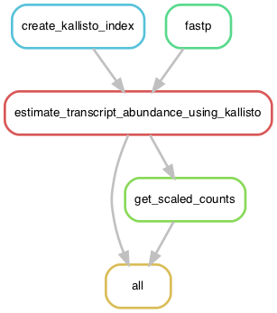

# A Snakemake RNA-Seq analysis pipeline relying on Kallisto and Sleuth
mRNA-Seq analysis using Kallisto and Sleuth.

A snakemake pipeline for the analysis of RNA-seq data that makes use of [Kallisto and sleuth](https://scilifelab.github.io/courses/rnaseq/labs/kallisto).

## Aim
To align, count, normalize counts and compute differential gene expressions between conditions using single-end, paired-end or a mixture of both Illumina RNA-seq data.

## Description
This pipeline analyses the raw RNA-seq data and produce a file containing normalized counts and differential expressions. The raw fastq files will be trimmed for adaptors and quality checked with trimmomatic. Next, the trimmed reads are mapped and counted to produce abundance files against the transcriptome fasta file using kallisto. The counts are normalized and differential expressions are calculated using sleuth.

## Content
- `Snakefile`: a master file that contains the desired outputs and the rules to generate them from the input files.
- `config.yaml`: the configuration files making the Snakefile adaptable to any input files, transcriptome and parameters for the rules.
- `fastq/`: This folder should contain pairs of paired-end reads, single-end, or a mixture of paired and single-end reads in fastq format.
- `envs/`: a folder containing the environments needed for the conda package manager. If run with the `--use-conda` command, Snakemake will install the necessary softwares and packages using the conda environment files.
- `samples.tsv`:  a file containing information about the names, the paths and the conditions of the samples used.
**This file has to be adapted to your sample names before running the pipeline**.

# Usage

## Download or clone the Github repository
You will need a local copy of the `rnaseq-analysis-kallisto-sleuth` on your machine. You can either:
- use git in the shell: `git clone git@github.com:BleekerLab/rnaseq-analysis-kallisto-sleuth.git`
- click on "Clone or download" and select `download`

## Installing and activating a virtual environment
First, you need to create an environment where `Snakemake` and the python `pandas`package will be installed. To do that, we will use the conda package manager.   
1. Create a virtual environment named `rnaseq` using the `environment.yaml` file with the following command: `conda env create --file environment.yaml`
2. Then, activate this virtual environment with `source activate rnaseq` or  `conda activate rnaseq` (with `conda =>4.5.0`)
By using the software and package manager conda, Snakemake will then take care of installing and loading the packages and softwares required by each step of the pipeline.

## Configuration file
Make sure you have changed the parameters in the `config.yaml` file that specifies where to find:
- the sample data file `samples.tsv`
- the genomic and transcriptomic reference fasta files
- various parameters for certain softwares etc.    
This file is used so the `Snakefile` does not need to be changed when locations or parameters need to be changed.

## Experimental design (samples.tsv)
To get the right reads to the samples the 'sample.tsv' needs to contain certain features.
the column name of the column comtaining the sample names needs to be 'sample'
the column names of of the columns containg the forward and reverse reads need to be 'fq1' and 'fq2'
the column containing conditions, genotypes, treatment, etc is free of choise.

example of a file for an experiment containing paired-end reads:

| sample   | treatment | fq1 | fq2 |
| ------- | ---------- |-----|-----|
| sample1 | control | readsS1_R1.fastq | readsS1_R2.fastq |
| sample2 | control | readsS2_R1.fastq | readsS2_R2.fastq |
| sample3 | treated | readsS3_R1.fastq | readsS3_R2.fastq |
| sample4 | treated | readsS4_R1.fastq | readsS4_R2.fastq |

In case of an experiment containing only single-end reads, the column 'fq2' can be omitted.
The 'sample.tsv' will then look something like this:

| sample   | treatment | fq1 |
| ------- | ---------- |-----|
| sample1 | control | readsS1.fastq |
| sample2 | control | readsS2.fastq |
| sample3 | treated | readsS3.fastq |
| sample4 | treated | readsS4.fastq |

If the experiment contains both single and paired end reads, it should be something like this:

| sample   | condition | fq1 | fq2 |
| ------- | ---------- |-----|-----|
| sample1 | control | readsS1_R1.fastq | readsS1_R2.fastq |
| sample2 | control | readsS2.fastq | |
| sample3 | treated | readsS3_R1.fastq | readsS3_R2.fastq |
| sample4 | treated | readsS4.fastq | |

# Snakemake execution
The Snakemake pipeline/workflow management system reads a master file (often called `Snakefile`) to list the steps to be executed and defining their order. It has many rich features. Read more [here](https://snakemake.readthedocs.io/en/stable/).

## Dry run
From the folder containing the `Snakefile`, use the command `snakemake -np` to perform a dry run that prints out the rules and commands.

## Test run
Open a Shell window and execute these steps:
* `conda activate rnaseq`
* `snakemake --use-conda --directory .test`

## Cluster execution
For cluster execution, please refer to the [Snakemake reference](https://snakemake.readthedocs.io/en/stable/executable.html#cluster-execution).

# Main outputs
- the transcript abundance files abundance.tsv.

# Simulating RNA-Seq reads
A series of RNA-Seq sequencing files are available in the `data/` folder. These files are used to test the pipeline. 
These fastq files were generated in two steps: 
* using the R script`simulate_reads.R` that uses the [R `polyester` package](https://www.bioconductor.org/packages/release/bioc/vignettes/polyester/inst/doc/polyester.html) to generate _fasta_ files.  
* Then, convert the generated fasta files to fastq files using the custom script: `convert_fasta_to_fastq_by_generating_qual_scores.py`. This script attach Phred score qualities to the fasta sequences and converts it to reads.     

Change settings from the `simulate_experiment` function in the R script if you want to regenerate RNA-Seq reads using different settings. See the vignette for more details: https://www.bioconductor.org/packages/release/bioc/vignettes/polyester/inst/doc/polyester.html.   

Install and activate the conda environment named _simulate_ using the conda environment file `simulate_reads.yaml` available in the `envs/` before running the scripts. 

# Graph of jobs

